# BEHAVIOR 网站资源、机器人与贡献者论文型号调研

核验日期：2026-07-02
官网快照：2026-07-02T07:46:02.019456+00:00

## 执行摘要与数量统计

- 网站资源共 15 项。
- 官网贡献者共 57 人。
- 网站机器人页面实际整理出 14 个条目。
- 已核验贡献者—论文—型号记录共 32 条，覆盖
  13 位当前官网贡献者、2 篇论文。
- 待全文核验的贡献者—论文候选共 70 条。

### 网站机器人类型数量

| 类型 | 数量 | 型号 |
| --- | --- | --- |
| 纯轮式移动机器人 | 4 | TurtleBot 2 / Kobuki、LoCoBot、Clearpath Husky、Fetch Robotics Freight |
| 固定机械臂 | 4 | Franka Research 3、Trossen ViperX 300 6DOF、A1、Franka Research 3 mounted cart |
| 轮式机械臂机器人 | 5 | Fetch、PAL Robotics TIAGo (dual-arm configuration)、Hello Robot Stretch、Galaxea R1、Galaxea R1 Pro |
| VR 双臂代理 | 1 | BehaviorRobot |

### 已核验论文中的型号使用排名

排名主指标为“贡献者—论文—型号”记录数；贡献者数和论文数用于辅助判断。以下均取前 5 名，
当前证据不足 5 个型号时只列已有型号。

#### 纯轮式移动机器人

##### 官网明确提及的型号

BEHAVIOR 官网明确列出了以下 4 种纯轮式移动机器人：

| 官网型号 | 图片 | 厂商 | 机械臂状态 | 官网证据 |
| --- | --- | --- | --- | --- |
| TurtleBot 2 / Kobuki | <a href="https://behavior.stanford.edu/assets/robots/Turtlebot.png">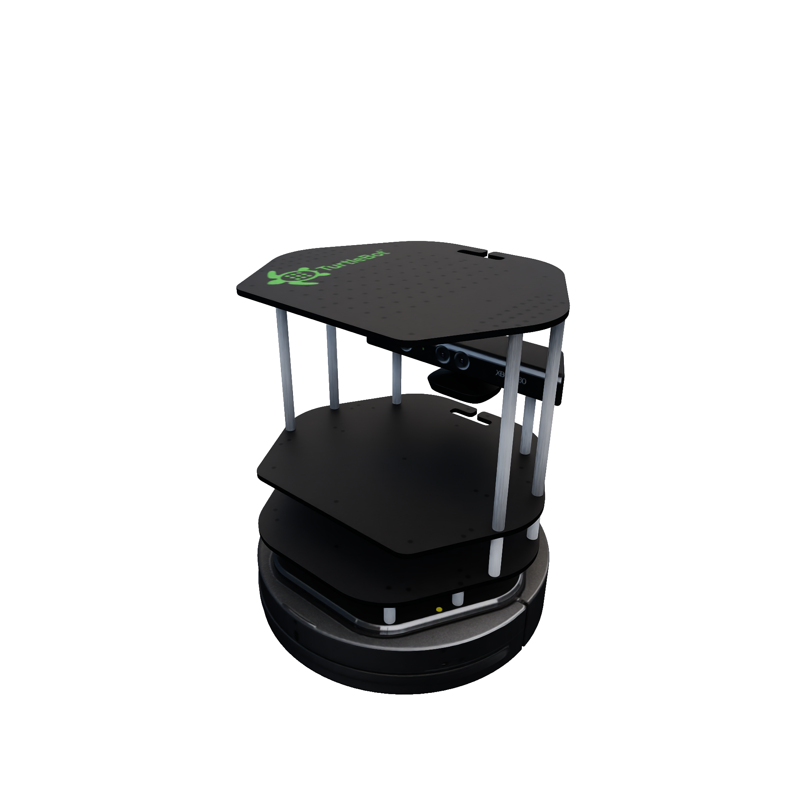</a> | Yujin Robot / Open Robotics |  | https://behavior.stanford.edu/omnigibson/robots.html |
| LoCoBot | <a href="https://behavior.stanford.edu/assets/robots/Locobot.png">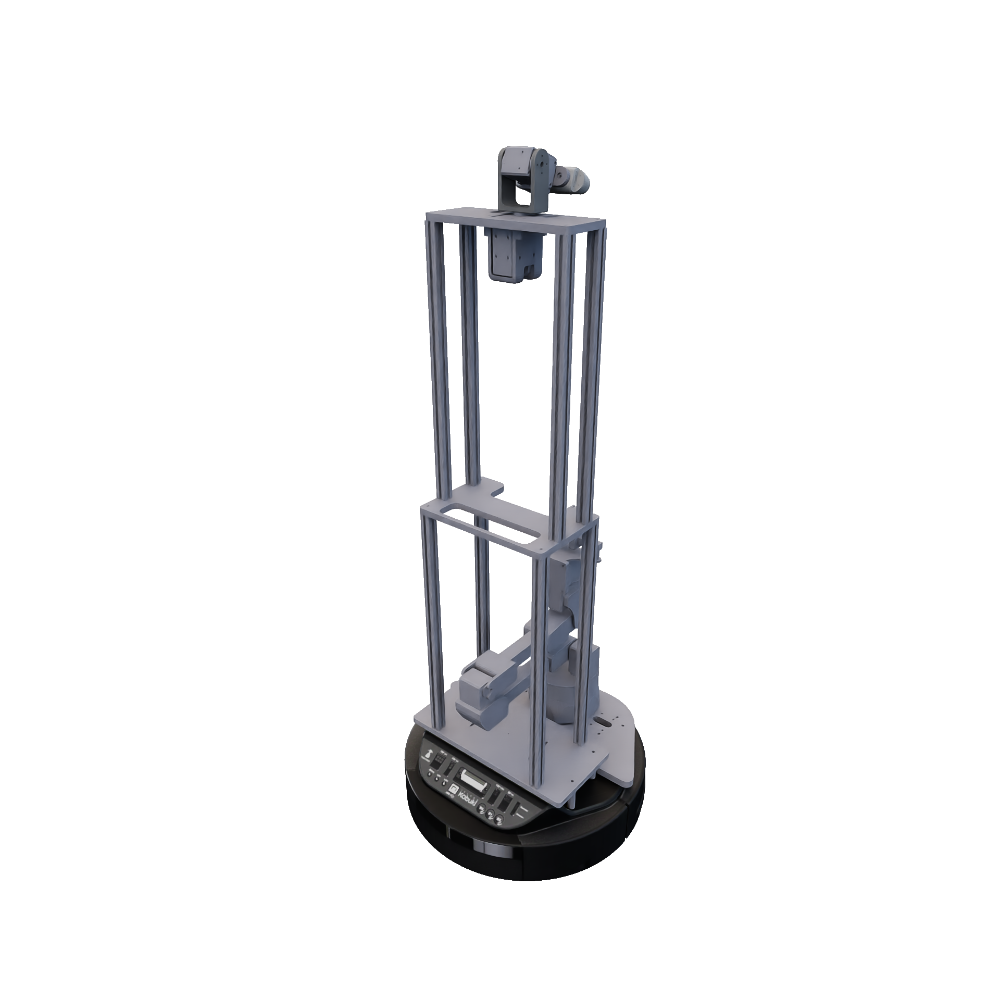</a> | Trossen Robotics / Interbotix | LoCoBot arm (disabled) | https://behavior.stanford.edu/omnigibson/robots.html |
| Clearpath Husky | <a href="https://behavior.stanford.edu/assets/robots/Husky.png">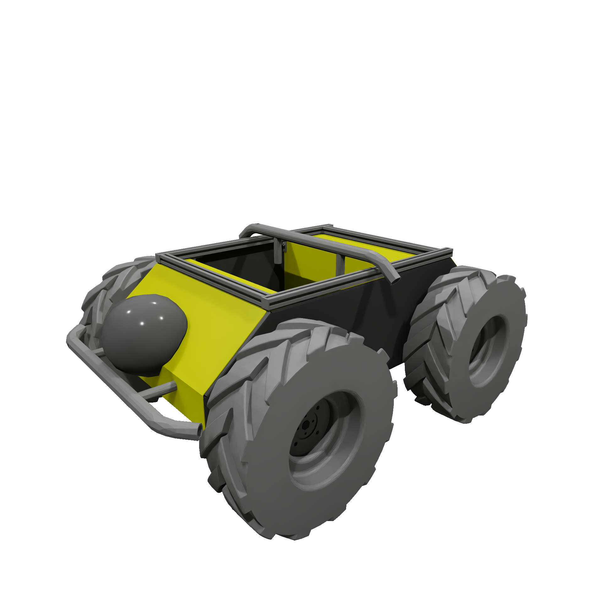</a> | Clearpath Robotics |  | https://behavior.stanford.edu/omnigibson/robots.html |
| Fetch Robotics Freight | <a href="https://behavior.stanford.edu/assets/robots/Freight.png">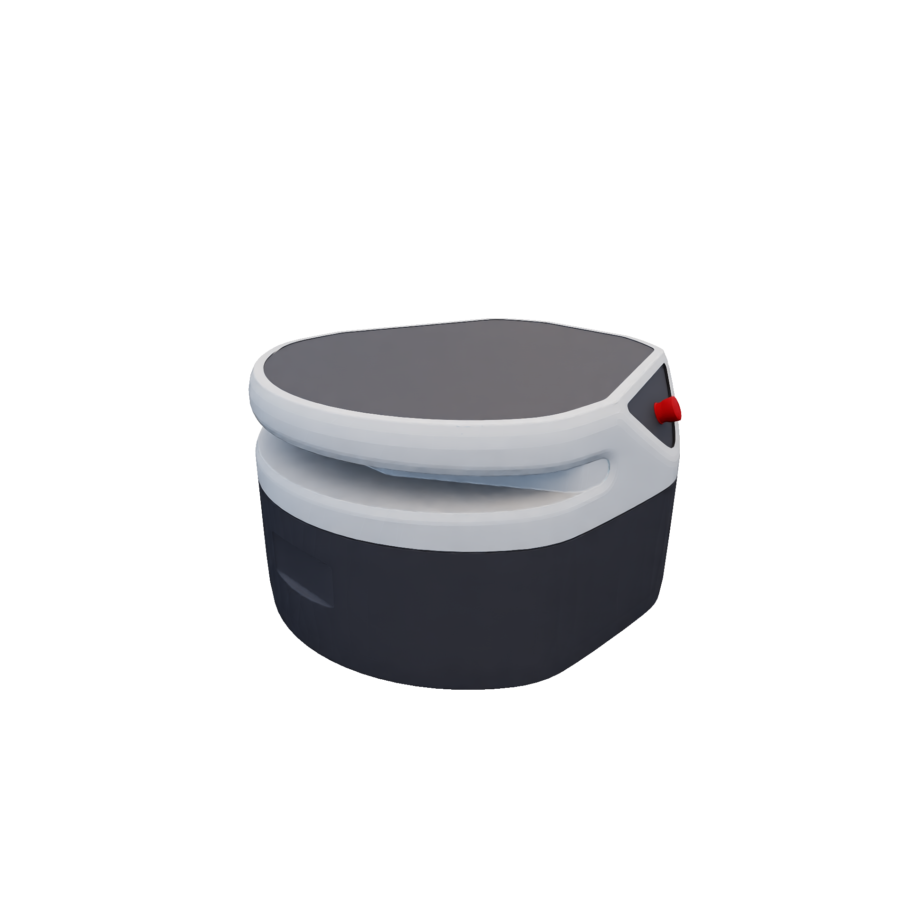</a> | Fetch Robotics |  | https://behavior.stanford.edu/omnigibson/robots.html |

其中 LoCoBot 实物平台带有机械臂，但 BEHAVIOR / OmniGibson 文档明确说明其模型中的机械臂被禁用
并固定在底座上，因此本报告按官网运行配置把它归入纯轮式移动机器人。

##### 已核验贡献者论文中的使用排名

_无记录。_

当前已核验的贡献者论文中，没有发现上述 4 种纯轮式移动机器人作为实验或数据采集平台的明确
型号证据，因此暂时无法给出论文使用频次排名。这里的“无记录”只表示论文核验结果为空，
不表示官网没有提及这些机器人。

#### 机械臂型号

此处统计论文实际使用的机械臂，包括集成在轮式机械臂机器人上的机械臂；它不同于上方网站清单中
“固定机械臂”这一平台类别。

| 排名 | 型号 | 记录数 | 贡献者数 | 论文数 |
| --- | --- | --- | --- | --- |
| 1 | Galaxea R1 integrated arm (6-DoF) | 20 | 13 | 2 |
| 2 | PAL Robotics TIAGo integrated arm (7-DoF) | 12 | 12 | 1 |

#### 轮式机械臂机器人

| 排名 | 型号 | 记录数 | 贡献者数 | 论文数 |
| --- | --- | --- | --- | --- |
| 1 | Galaxea R1 | 20 | 13 | 2 |
| 2 | PAL Robotics TIAGo (dual-arm configuration) | 12 | 12 | 1 |

当前第一名是 Galaxea R1，第二名是 PAL Robotics TIAGo（双臂配置）。该结论只适用于已经完成
型号证据核验的论文集合，不代表机器人学全部论文的市场占有率。

## 采购价格参考

价格快照日期：2026-07-02。人民币换算采用 2026-07-01
的统一参考汇率（USD/CNY=6.7945，
EUR/CNY=7.7342，
JPY/CNY=0.04176）。人民币金额仅用于横向比较，
不包含来源未明确的税费、运费、关税、安装、软件许可或集成服务。

### 各类别公开数字新品参考范围

| 类别 | 具有公开数字新品参考的报价数 | 最低人民币参考 | 最高人民币参考 |
| --- | --- | --- | --- |
| 纯轮式移动机器人 | 3 | ¥29,012 | ¥208,823 |
| 固定机械臂 | 2 | ¥20,377 | ¥256,621 |
| 轮式机械臂机器人 | 3 | ¥203,495 | ¥475,608 |

这里的“新品参考”允许同系列当前代或后继配置，但价格表会明确标注匹配关系；历史价、
停产价和低置信第三方估值不进入上述范围。正式价格表不收录二手报价。

### 纯轮式移动机器人价格

| BEHAVIOR型号 | 图片 | 销售型号或配置 | 匹配关系 | 价格性质 | 供应状态 | 原币价格 | 人民币参考 | 来源 | 可信度 | 价格链接 | 说明 |
| --- | --- | --- | --- | --- | --- | --- | --- | --- | --- | --- | --- |
| TurtleBot 2 / Kobuki |  | TurtleBot 2 complete kit | historical launch estimate | historical new-price estimate | discontinued | 约 USD 1,500.00 | 约 ¥10,192 | IEEE Spectrum | medium | https://spectrum.ieee.org/amp/turtlebot-2-prototypes-unveiled-at-roscon-2-2650266563 | Contemporaneous 2012 estimate of about USD 1,500 for a complete TurtleBot 2; not a firm quote or current offer. |
| LoCoBot |  | LoCoBot V4 PX100 with LiDAR (ROS 2) | same family configuration | new | sold out / built to order timing by sales | USD 4,269.95 | 约 ¥29,012 | Trossen Robotics | high | https://store.trossenrobotics.com/products/px100-locobot-2 | Official LoCoBot family configuration; the BEHAVIOR simulation disables and fixes its arm. |
| Clearpath Husky |  | Clearpath Husky A200 | exact | new | order item | EUR 23,353.75 | 约 ¥180,623 | MYBOTSHOP | medium | https://www.mybotshop.de/Clearpath | Exact A200 new mobile-base listing; optional sensors, computer and manipulators are separate. |
| Clearpath Husky |  | Clearpath Husky A300 | successor/reference only | new | order item | 起价 EUR 27,000.00 | 约 ¥208,823 | Generation Robots | medium | https://www.generationrobots.com/en/404267-husky-a300-ugv-mobile-base-1807.html | Current A300 successor reference only; it is not assigned as the A200 price. |
| Fetch Robotics Freight |  | Fetch Robotics Freight base | historical base model | historical new list price | legacy / no current new public offer | 起价 USD 35,000.00 | 约 ¥237,808 | ROBOTS Guide | medium | https://robotsguide.com/robots/freight | Historical base price; not a current quotation. |

### 固定机械臂价格

| BEHAVIOR型号 | 图片 | 销售型号或配置 | 匹配关系 | 价格性质 | 供应状态 | 原币价格 | 人民币参考 | 来源 | 可信度 | 价格链接 | 说明 |
| --- | --- | --- | --- | --- | --- | --- | --- | --- | --- | --- | --- |
| Franka Research 3 | <a href="https://behavior.stanford.edu/assets/robots/FrankaPanda.png">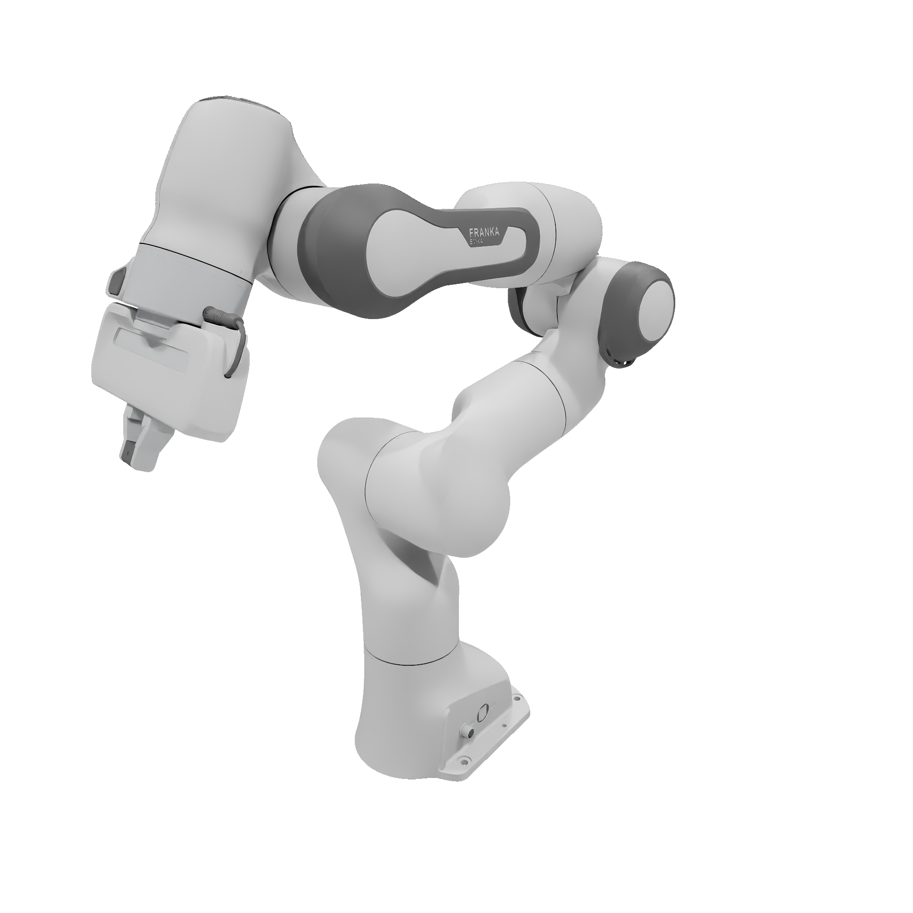</a> | Franka Research 3 | exact | new | official enquiry | 询价 |  | Franka Robotics | high | https://franka.de/franka-research-3 | Official page provides a purchase/enquiry flow but no public numeric price. |
| Franka Research 3 |  | Franka Research 3 with FCI licence | exact commercial configuration | new | order item; eight-week delivery shown | 起价 EUR 33,180.00 | 约 ¥256,621 | Generation Robots | medium | https://www.generationrobots.com/en/403992-7-axis-franka-research-3-robotic-arm-fci-licence.html | Public new-price reference for an exact FR3 system including controller and FCI; the gripper is listed separately. |
| Trossen ViperX 300 6DOF | <a href="https://behavior.stanford.edu/assets/robots/VX300S.png">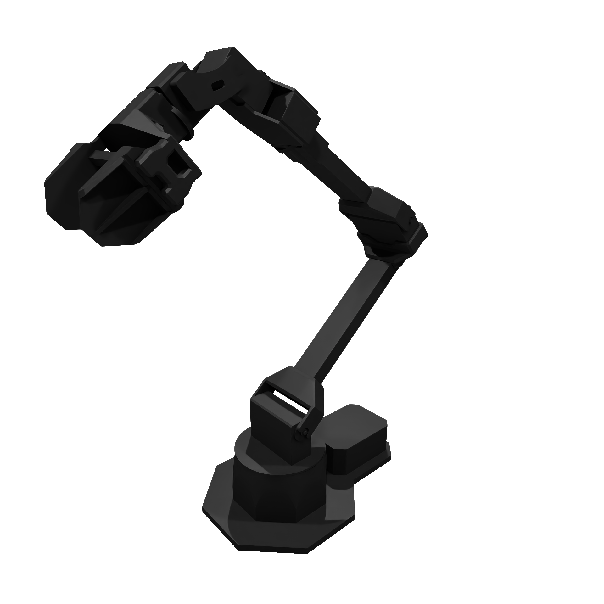</a> | ViperX 300 S Robot Arm, legacy 6DOF | exact legacy configuration | last listed new price | discontinued / sold out | USD 6,742.95 | 约 ¥45,815 | Trossen Robotics | high | https://store.trossenrobotics.com/products/viperx-300-s-robot-arm | Official last-listed price for the discontinued legacy arm. |
| A1 | <a href="https://behavior.stanford.edu/assets/robots/A1.png">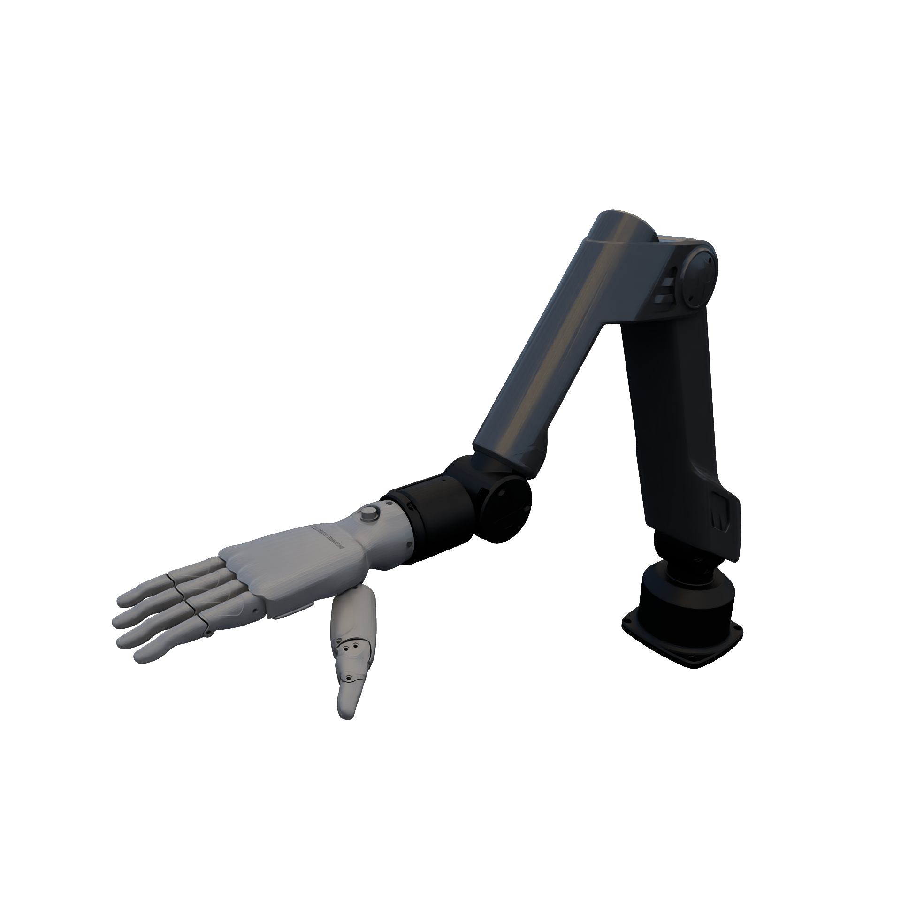</a> | Galaxea A1 | exact | new | no public exact-model price | 询价 |  | Galaxea Dynamics | high | https://galaxea-dynamics.com/products/6-dof-ultra-light-robot-arm | The current official store sells A1Z, not the legacy A1; no public exact legacy A1 price was found. Do not confuse with Unitree A1, and do not assign the A1Z price to this model. |
| A1 |  | Galaxea A1Z | successor/reference only | new | in official store | USD 2,999.00 | 约 ¥20,377 | Galaxea Dynamics | high | https://galaxea-dynamics.com/collections/frontpage | Reference price for current A1Z only; it is not presented as the price of the BEHAVIOR A1. |
| Franka Research 3 mounted cart | <a href="https://behavior.stanford.edu/assets/robots/FrankaMounted.png">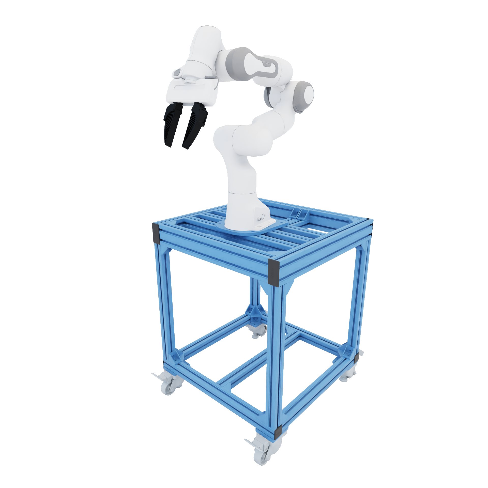</a> | Franka Research 3 mounted on custom extrusion cart | custom BEHAVIOR configuration | new/custom | no complete commercial bundle | 无公开价格 |  | Franka Robotics | high | https://franka.de/franka-research-3 | The cart is a BEHAVIOR configuration, not a priced Franka product. No component prices are added together. |

### 轮式机械臂机器人价格

| BEHAVIOR型号 | 图片 | 销售型号或配置 | 匹配关系 | 价格性质 | 供应状态 | 原币价格 | 人民币参考 | 来源 | 可信度 | 价格链接 | 说明 |
| --- | --- | --- | --- | --- | --- | --- | --- | --- | --- | --- | --- |
| Fetch | <a href="https://behavior.stanford.edu/assets/robots/Fetch.png">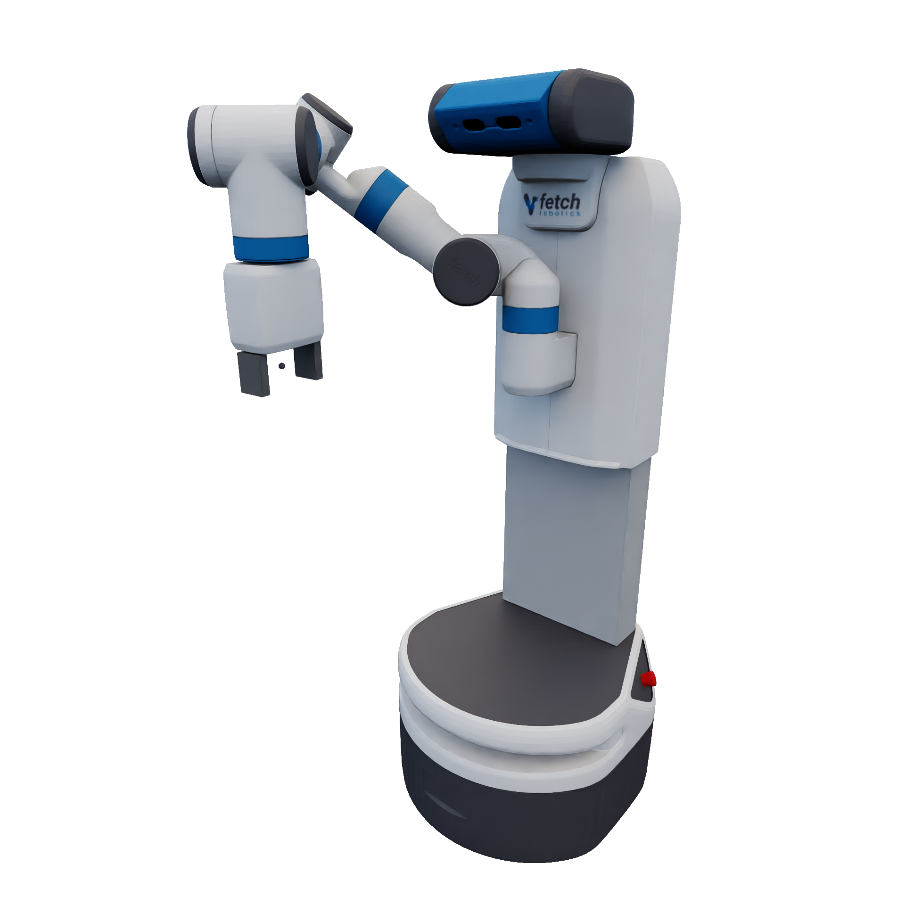</a> | Fetch Mobile Manipulator | exact | historical new list price | legacy / no current new public offer | 起价 USD 100,000.00 | 约 ¥679,450 | ROBOTS Guide | medium | https://robotsguide.com/robots/fetch | Historical base price for the complete Fetch mobile manipulator; not a current quotation. |
| PAL Robotics TIAGo (dual-arm configuration) | <a href="https://behavior.stanford.edu/assets/robots/Tiago.png">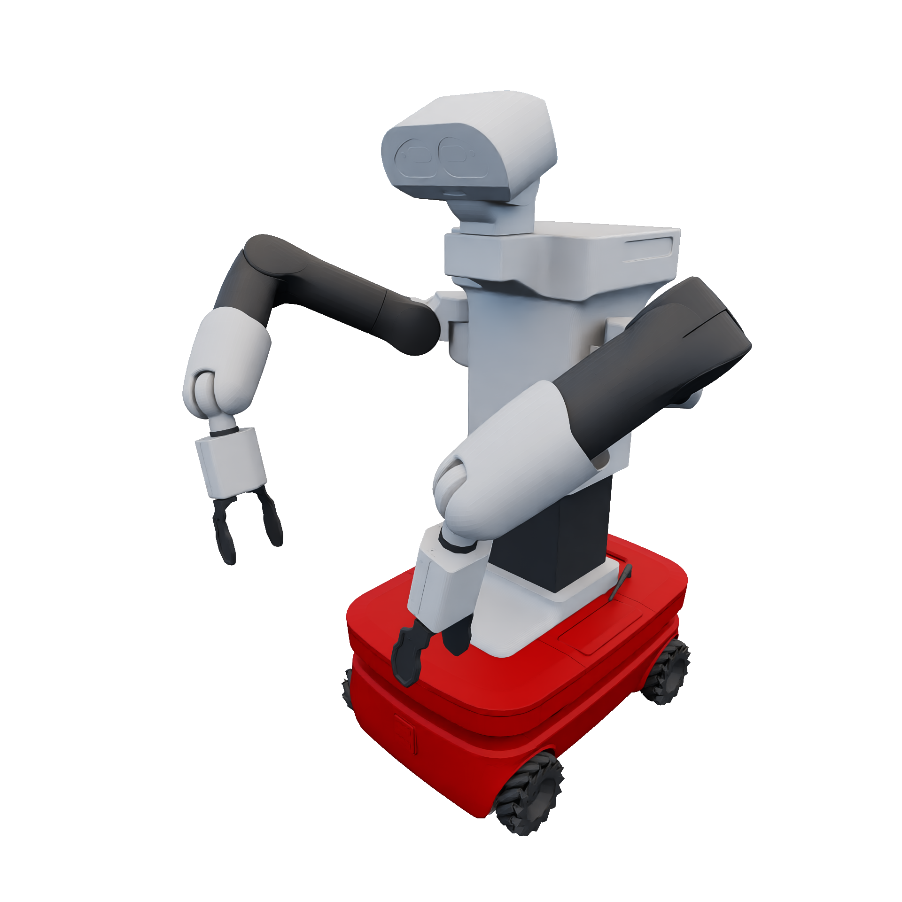</a> | PAL Robotics TIAGo dual-arm configuration | exact configuration class | new | official request for quote | 询价 |  | PAL Robotics | high | https://pal-robotics.com/robot/tiago/ | TIAGo Head and single-arm prices are not substituted for the dual-arm configuration. |
| PAL Robotics TIAGo (dual-arm configuration) |  | PAL Robotics TIAGo / TIAGo++ configurations | third-party indicative range | new estimate | commercially available | USD 30,000.00–100,000.00 | ¥203,835–¥679,450 | BotMarket24 | low | https://botmarket24.com/en/robot-database/pal-tiago/ | Indicative family range, not an official quote for the exact dual-arm configuration. |
| Hello Robot Stretch | <a href="https://behavior.stanford.edu/assets/robots/Stretch.png">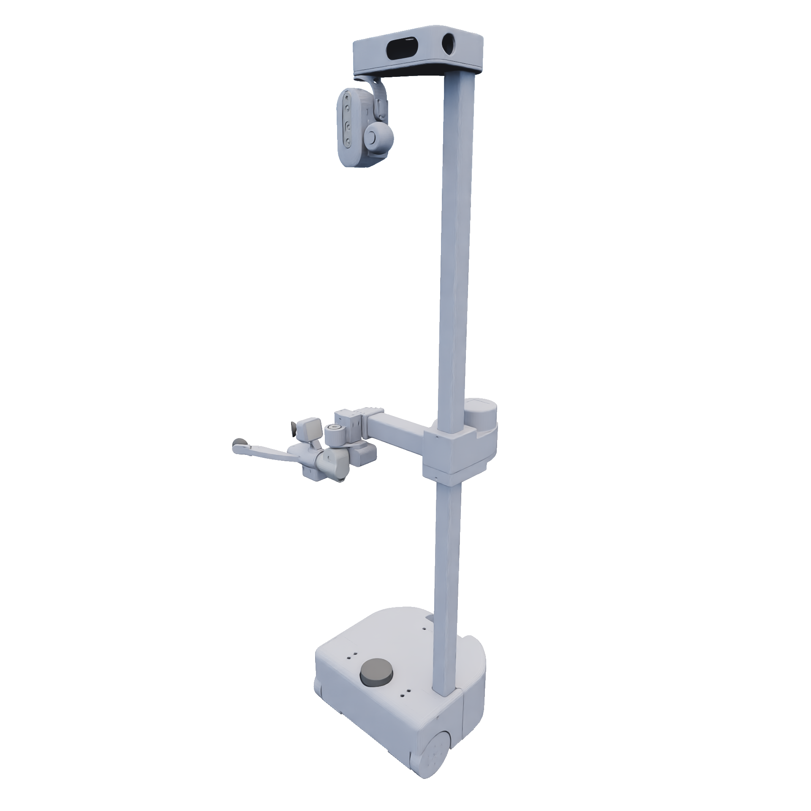</a> | Hello Robot Stretch 3 | previous-generation historical reference | historical new list price | superseded by Stretch 4 | USD 24,950.00 | 约 ¥169,523 | ui44 | medium | https://ui44.com/robots/hello-robot-stretch-3 | Previous-generation Stretch 3 list-price reference; BEHAVIOR names the family generically as Stretch. |
| Hello Robot Stretch |  | Hello Robot Stretch 4 | current-generation reference | new | available; typically ships in 2–4 weeks | USD 29,950.00 | 约 ¥203,495 | Hello Robot | high | https://hello-robot.com/purchase/ | Current Stretch 4 price; it is a family successor reference, not proof that the BEHAVIOR asset is Stretch 4. |
| Galaxea R1 | <a href="https://behavior.stanford.edu/assets/robots/R1.png">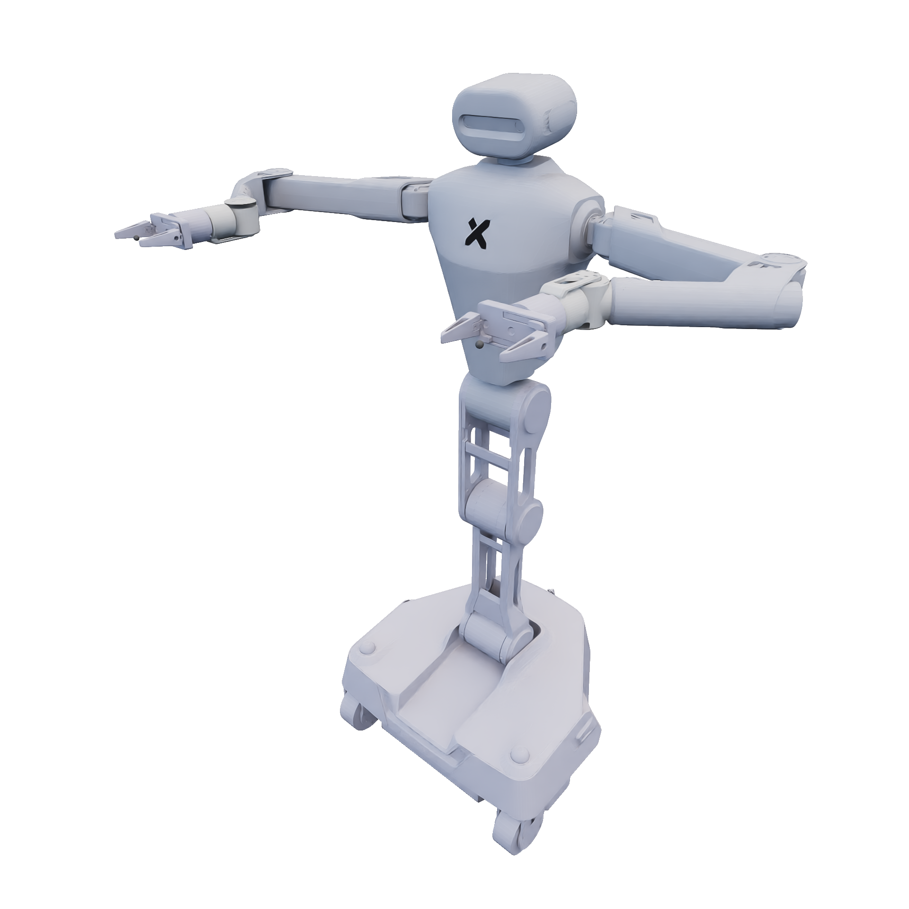</a> | Galaxea R1 legacy 6-DOF-arm platform | exact legacy family | legacy | no current exact-model public price | 无公开价格 |  | Galaxea Dynamics | high | https://galaxea-dynamics.com/products/6-dof-general-mobile-manipulation-platform | The current official store sells R1 Lite 2026, not the legacy R1; no current exact-model public price was found. Do not confuse with Unitree R1, and treat R1 Lite only as a successor reference. |
| Galaxea R1 |  | Galaxea R1 Lite 2026 | successor/reference only | new | in stock / order inquiry | USD 39,999.00 | 约 ¥271,773 | Galaxea Dynamics | high | https://galaxea-dynamics.com/products/6-dof-general-mobile-manipulation-platform | Current R1 Lite successor reference; not assigned as the legacy R1 exact price. |
| Galaxea R1 Pro | <a href="https://behavior.stanford.edu/assets/robots/R1Pro.png">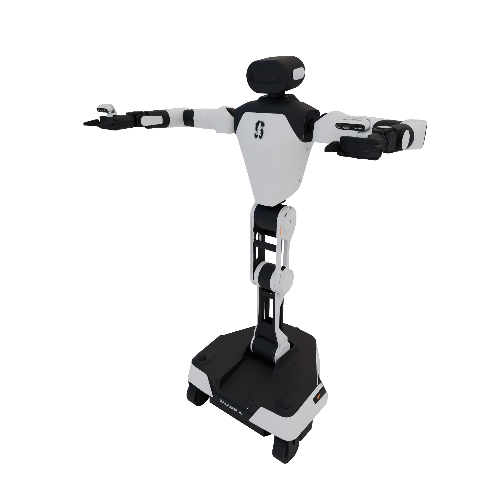</a> | Galaxea R1 Pro 2026 | current exact family | new | in stock / order inquiry | USD 69,999.00 | 约 ¥475,608 | Galaxea Dynamics | high | https://galaxea-dynamics.com/products/galaxea-r1-pro-universal-humanoid-robot | Package includes base, two 7-DOF arms and two G1 grippers; optional cameras and dexterous hands are excluded. |

### 非商品虚拟代理

| BEHAVIOR型号 | 图片 | 销售型号或配置 | 匹配关系 | 价格性质 | 供应状态 | 原币价格 | 人民币参考 | 来源 | 可信度 | 价格链接 | 说明 |
| --- | --- | --- | --- | --- | --- | --- | --- | --- | --- | --- | --- |
| BehaviorRobot | <a href="https://behavior.stanford.edu/assets/robots/BehaviorRobot.png">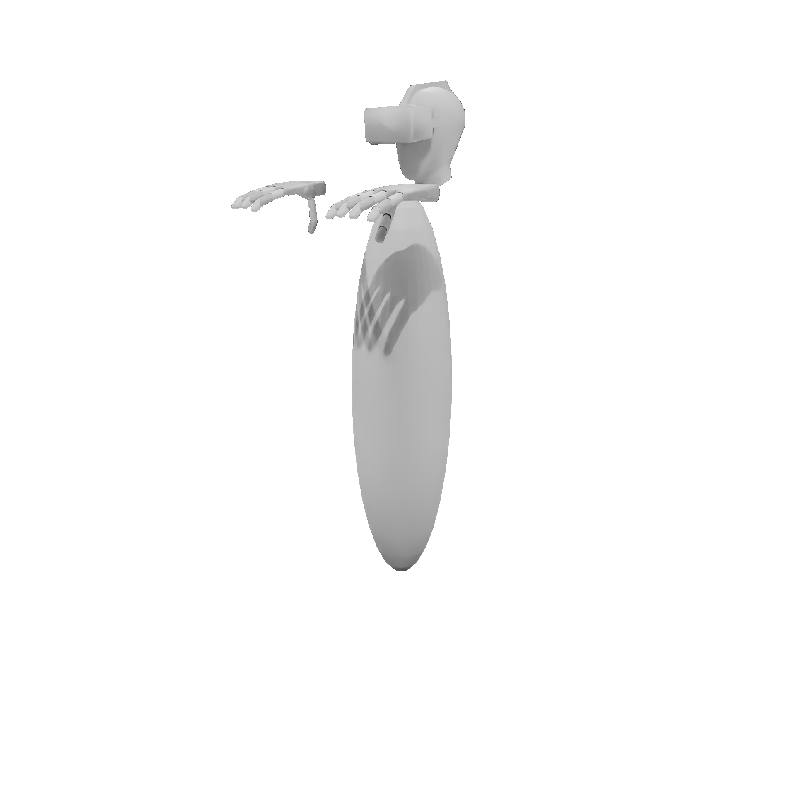</a> | BehaviorRobot | exact virtual agent | not applicable | non-commercial software model | 非商品 |  | BEHAVIOR project | high | https://behavior.stanford.edu/omnigibson/robots.html | Virtual agent used for VR teleoperation; it is not a commercial physical robot. |

重要边界：

- 本报告按最新要求不展示任何二手价格；停产型号只保留有日期或可追溯的历史新品价。
- TurtleBot 2 的 USD 1,500 是 IEEE Spectrum 在 2012 年产品原型发布时给出的整机近似价格，
  不是固定报价或当前售价。
- Husky A200 的 EUR 23,353.75 是专业机器人零售商的精确型号新品价；A300 仍仅作后继参考。
- A1 的精确旧型号没有公开价；A1Z 的 USD 2,999 仅作为当前相关型号参考。
- FR3 官网采用询价；Generation Robots 的 EUR 33,180 含税起价是精确商业配置的公开参考。
- Franka Mounted 是项目自定义推车配置，不把 FR3 与推车部件价格自行相加。
- Fetch 与 Freight 属于旧平台，只保留 ROBOTS Guide 的历史新品基础价。
- TIAGo 双臂配置以官网询价为准，USD 30,000–100,000 只是低置信第三方家族区间。
- Stretch 3 的 USD 24,950 是上一代历史新品参考；当前 Stretch 4 官网价为 USD 29,950。
- Galaxea R1 不与 Unitree R1 混用；R1 Lite 2026 的 USD 39,999 仅作旧 R1 后继型号参考。
- BehaviorRobot 是虚拟代理，不是可采购的实体机器人。

## 口径与结论边界

- 官网贡献者：57 人，覆盖 Core Team、Supporting Team、Alumni。
- 论文窗口：2022-01-01 至 2026-07-01。
- 候选发现：Crossref/OpenAlex 提供论文候选，不直接证明机器人型号。
- 正式明细只接收论文正文、补充材料、官方项目页或官方代码明确支持的型号证据。
- 主排名按“贡献者—论文—型号”记录数；并附不同贡献者数和不同论文数。
- “论文全集”是公开渠道可发现、可核验的集合，不包含未索引或不可访问全文。

## 贡献者覆盖

| group | count |
| --- | --- |
| Alumni | 31 |
| Core Team | 15 |
| Supporting Team | 11 |

## List 1：网站可提供的资源

| category | name | description | url |
| --- | --- | --- | --- |
| Benchmark | BEHAVIOR-1K | 1,000 long-horizon household activities instantiated in OmniGibson. | https://behavior.stanford.edu/ |
| Benchmark | BEHAVIOR-100 | Earlier 100-activity benchmark instantiated in iGibson 2.0. | https://behavior.stanford.edu/behavior_100/overview.html |
| Simulator | OmniGibson | Interactive simulation with rigid bodies, deformables, liquids, thermal effects and transitions. | https://behavior.stanford.edu/getting_started/quickstart.html |
| Task definitions | BDDL | Predicate-based household task definitions and activity logic. | https://behavior.stanford.edu/behavior_components/behavior_tasks.html |
| Knowledgebase | BEHAVIOR-1K Knowledgebase | Browse tasks, synsets, objects, categories, scenes, transitions and attachments. | https://behavior.stanford.edu/knowledgebase/ |
| 3D assets | Scenes | Interactive household and other scene assets. | https://behavior.stanford.edu/behavior_components/scenes.html |
| 3D assets | Objects | Thousands of annotated object assets and categories. | https://behavior.stanford.edu/behavior_components/objects.html |
| Robot software | Robot models and controllers | Robot embodiments, controller interfaces and sensor interfaces. | https://behavior.stanford.edu/omnigibson/robots.html |
| Data collection | Teleoperation | JoyLo and VR teleoperation plus task sampling and data collection documentation. | https://behavior.stanford.edu/behavior_components/joylo.html |
| Dataset | 2026 BEHAVIOR Challenge Dataset | Current challenge demonstration and evaluation data entry point. | https://behavior.stanford.edu/challenge/dataset.html |
| Evaluation | 2026 BEHAVIOR Challenge | Current rules, baselines, leaderboard, submission guide and demo gallery. | https://behavior.stanford.edu/challenge/ |
| Dataset | BEHAVIOR-100 VR Dataset | VR demonstrations associated with BEHAVIOR-100. | https://behavior.stanford.edu/behavior_100/dataset.html |
| Toolkit | BEHAVIOR Vision Suite | Controllable synthetic visual data generation using BEHAVIOR assets. | https://behavior-vision-suite.github.io/ |
| Research | Related Research | Official index of BEHAVIOR-related projects and the Gibson simulation series. | https://behavior.stanford.edu/other/related_research.html |
| Code | BEHAVIOR-1K GitHub | Official source code repository. | https://github.com/StanfordVL/BEHAVIOR-1K |

Challenge 年份已分别从首页和落地页提取，两处当前均为 2026 BEHAVIOR Challenge。

## List 2：网站明确提及或支持的机器人、机械臂

| site_name | model | 图片 | image_path | image_source_url | category | manufacturer | dof | arm_model | end_effector | evidence_url | manufacturer_evidence_url | arm_evidence_url | end_effector_evidence_url |
| --- | --- | --- | --- | --- | --- | --- | --- | --- | --- | --- | --- | --- | --- |
| Turtlebot | TurtleBot 2 / Kobuki |  | assets/robots/Turtlebot.png | https://behavior.stanford.edu/assets/robots/Turtlebot.png | mobile robot | Yujin Robot / Open Robotics |  |  |  | https://behavior.stanford.edu/omnigibson/robots.html | https://www.turtlebot.com/turtlebot2/ |  |  |
| Locobot | LoCoBot |  | assets/robots/Locobot.png | https://behavior.stanford.edu/assets/robots/Locobot.png | mobile robot | Trossen Robotics / Interbotix |  | LoCoBot arm (disabled) |  | https://behavior.stanford.edu/omnigibson/robots.html | https://docs.trossenrobotics.com/interbotix_xslocobots_docs/ | https://behavior.stanford.edu/omnigibson/robots.html |  |
| Husky | Clearpath Husky |  | assets/robots/Husky.png | https://behavior.stanford.edu/assets/robots/Husky.png | mobile robot | Clearpath Robotics |  |  |  | https://behavior.stanford.edu/omnigibson/robots.html | https://docs.clearpathrobotics.com/docs_robots/outdoor_robots/husky/a200/user_manual_husky |  |  |
| Freight | Fetch Robotics Freight |  | assets/robots/Freight.png | https://behavior.stanford.edu/assets/robots/Freight.png | mobile robot | Fetch Robotics |  |  |  | https://behavior.stanford.edu/omnigibson/robots.html | https://fetchrobotics.github.io/docs/ |  |  |
| Franka | Franka Research 3 |  | assets/robots/FrankaPanda.png | https://behavior.stanford.edu/assets/robots/FrankaPanda.png | stationary manipulator | Franka Robotics | 7-DoF arm | Franka Research 3 | parallel-jaw gripper | https://behavior.stanford.edu/omnigibson/robots.html | https://franka.de/franka-research-3-cobot-arm | https://behavior.stanford.edu/omnigibson/robots.html | https://behavior.stanford.edu/omnigibson/robots.html |
| VX300S | Trossen ViperX 300 6DOF |  | assets/robots/VX300S.png | https://behavior.stanford.edu/assets/robots/VX300S.png | stationary manipulator | Trossen Robotics | 6-DoF arm | ViperX 300 | parallel-jaw gripper | https://behavior.stanford.edu/omnigibson/robots.html | https://store.trossenrobotics.com/products/viperx-300-s-robot-arm | https://behavior.stanford.edu/omnigibson/robots.html | https://behavior.stanford.edu/omnigibson/robots.html |
| A1 | A1 |  | assets/robots/A1.png | https://behavior.stanford.edu/assets/robots/A1.png | stationary manipulator | Galaxea Dynamics | 6-DoF arm | A1 | Inspire-Robots Dexterous Hand | https://behavior.stanford.edu/omnigibson/robots.html | https://www.robotsusa.com/Galaxea-A1-A1-Robotic-Arm.htm | https://behavior.stanford.edu/omnigibson/robots.html | https://behavior.stanford.edu/omnigibson/robots.html |
| Franka Mounted | Franka Research 3 mounted cart |  | assets/robots/FrankaMounted.png | https://behavior.stanford.edu/assets/robots/FrankaMounted.png | stationary manipulator | Franka Robotics | 7-DoF arm | Franka Research 3 | parallel-jaw gripper | https://behavior.stanford.edu/omnigibson/robots.html | https://franka.de/franka-research-3-cobot-arm | https://behavior.stanford.edu/omnigibson/robots.html | https://behavior.stanford.edu/omnigibson/robots.html |
| Fetch | Fetch |  | assets/robots/Fetch.png | https://behavior.stanford.edu/assets/robots/Fetch.png | mobile manipulator | Fetch Robotics | 7-DoF arm | integrated 7-DoF Fetch arm | parallel-jaw gripper | https://behavior.stanford.edu/omnigibson/robots.html | https://fetchrobotics.github.io/docs/ | https://behavior.stanford.edu/omnigibson/robots.html | https://behavior.stanford.edu/omnigibson/robots.html |
| Tiago | PAL Robotics TIAGo (dual-arm configuration) |  | assets/robots/Tiago.png | https://behavior.stanford.edu/assets/robots/Tiago.png | bimanual mobile manipulator | PAL Robotics | 2 x 7-DoF arms | two integrated 7-DoF TIAGo arms | two parallel-jaw grippers | https://behavior.stanford.edu/omnigibson/robots.html | https://pal-robotics.com/robot/tiago/ | https://behavior.stanford.edu/omnigibson/robots.html | https://behavior.stanford.edu/omnigibson/robots.html |
| Stretch | Hello Robot Stretch |  | assets/robots/Stretch.png | https://behavior.stanford.edu/assets/robots/Stretch.png | mobile manipulator | Hello Robot | 5-DoF arm | integrated 5-DoF Stretch arm | Stretch gripper | https://behavior.stanford.edu/omnigibson/robots.html | https://hello-robot.com/ | https://behavior.stanford.edu/omnigibson/robots.html | https://behavior.stanford.edu/omnigibson/robots.html |
| R1 | Galaxea R1 |  | assets/robots/R1.png | https://behavior.stanford.edu/assets/robots/R1.png | bimanual mobile manipulator | Galaxea Dynamics | 2 x 6-DoF arms | two integrated 6-DoF R1 arms | two parallel-jaw grippers | https://behavior.stanford.edu/omnigibson/robots.html | https://arxiv.org/html/2503.05652 | https://behavior.stanford.edu/omnigibson/robots.html | https://behavior.stanford.edu/omnigibson/robots.html |
| R1 Pro | Galaxea R1 Pro |  | assets/robots/R1Pro.png | https://behavior.stanford.edu/assets/robots/R1Pro.png | bimanual mobile manipulator | Galaxea Dynamics | 2 x 7-DoF arms | two integrated 7-DoF R1 Pro arms | two parallel-jaw grippers | https://behavior.stanford.edu/omnigibson/robots.html | https://galaxea-dynamics.com/products/galaxea-r1-pro-universal-humanoid-robot | https://behavior.stanford.edu/omnigibson/robots.html | https://behavior.stanford.edu/omnigibson/robots.html |
| BehaviorRobot | BehaviorRobot |  | assets/robots/BehaviorRobot.png | https://behavior.stanford.edu/assets/robots/BehaviorRobot.png | VR bimanual agent proxy | BEHAVIOR project |  | two virtual arms | two virtual grippers | https://behavior.stanford.edu/omnigibson/robots.html | https://behavior.stanford.edu/omnigibson/robots.html | https://behavior.stanford.edu/omnigibson/robots.html | https://behavior.stanford.edu/omnigibson/robots.html |

官网机器人文档正文称支持 12 种机器人，但页面当前实际呈现 14 个条目。本表按页面条目记录，
并保留 Franka Mounted 等配置变体；这类变体不会被悄悄合并成另一型号。

## List 3：贡献者论文中已核验的机器人/机械臂型号

| person | contributor_group | homepage | paper | year | paper_url | project_url | doi | arxiv_id | model_raw | model_canonical | entity_type | robot_type | arm_model | end_effector | usage_context | world | evidence | evidence_url | evidence_location | verification_status |
| --- | --- | --- | --- | --- | --- | --- | --- | --- | --- | --- | --- | --- | --- | --- | --- | --- | --- | --- | --- | --- |
| Chengshu Li | Core Team | http://chengshuli.me | MoMaGen: Generating Demonstrations under Soft and Hard Constraints for Multi-Step Bimanual Mobile Manipulation | 2025 | https://arxiv.org/abs/2510.18316 | https://momagen.github.io/ |  | 2510.18316 | Galaxea R1 | Galaxea R1 | robot | bimanual mobile manipulator | Galaxea R1 integrated arm (6-DoF) | parallel-jaw gripper | 采集源演示并生成训练数据 | real and simulation | Project page says source demonstrations are collected on a Galaxea R1. | https://momagen.github.io/ | official project page | verified |
| Chengshu Li | Core Team | http://chengshuli.me | MoMaGen: Generating Demonstrations under Soft and Hard Constraints for Multi-Step Bimanual Mobile Manipulation | 2025 | https://arxiv.org/abs/2510.18316 | https://momagen.github.io/ |  | 2510.18316 | PAL Robotics TIAGo (dual-arm configuration) | PAL Robotics TIAGo (dual-arm configuration) | robot | bimanual mobile manipulator | PAL Robotics TIAGo integrated arm (7-DoF) | parallel-jaw gripper | 跨本体轨迹生成 | simulation | Project page says R1 demonstrations are converted into trajectories for a TIAGo robot. | https://momagen.github.io/ | official project page | verified |
| Arpit Bahety | Alumni | https://arpitrf.github.io/ | MoMaGen: Generating Demonstrations under Soft and Hard Constraints for Multi-Step Bimanual Mobile Manipulation | 2025 | https://arxiv.org/abs/2510.18316 | https://momagen.github.io/ |  | 2510.18316 | Galaxea R1 | Galaxea R1 | robot | bimanual mobile manipulator | Galaxea R1 integrated arm (6-DoF) | parallel-jaw gripper | 采集源演示并生成训练数据 | real and simulation | Project page says source demonstrations are collected on a Galaxea R1. | https://momagen.github.io/ | official project page | verified |
| Arpit Bahety | Alumni | https://arpitrf.github.io/ | MoMaGen: Generating Demonstrations under Soft and Hard Constraints for Multi-Step Bimanual Mobile Manipulation | 2025 | https://arxiv.org/abs/2510.18316 | https://momagen.github.io/ |  | 2510.18316 | PAL Robotics TIAGo (dual-arm configuration) | PAL Robotics TIAGo (dual-arm configuration) | robot | bimanual mobile manipulator | PAL Robotics TIAGo integrated arm (7-DoF) | parallel-jaw gripper | 跨本体轨迹生成 | simulation | Project page says R1 demonstrations are converted into trajectories for a TIAGo robot. | https://momagen.github.io/ | official project page | verified |
| Hang Yin | Core Team | https://hang-yin.github.io | MoMaGen: Generating Demonstrations under Soft and Hard Constraints for Multi-Step Bimanual Mobile Manipulation | 2025 | https://arxiv.org/abs/2510.18316 | https://momagen.github.io/ |  | 2510.18316 | Galaxea R1 | Galaxea R1 | robot | bimanual mobile manipulator | Galaxea R1 integrated arm (6-DoF) | parallel-jaw gripper | 采集源演示并生成训练数据 | real and simulation | Project page says source demonstrations are collected on a Galaxea R1. | https://momagen.github.io/ | official project page | verified |
| Hang Yin | Core Team | https://hang-yin.github.io | MoMaGen: Generating Demonstrations under Soft and Hard Constraints for Multi-Step Bimanual Mobile Manipulation | 2025 | https://arxiv.org/abs/2510.18316 | https://momagen.github.io/ |  | 2510.18316 | PAL Robotics TIAGo (dual-arm configuration) | PAL Robotics TIAGo (dual-arm configuration) | robot | bimanual mobile manipulator | PAL Robotics TIAGo integrated arm (7-DoF) | parallel-jaw gripper | 跨本体轨迹生成 | simulation | Project page says R1 demonstrations are converted into trajectories for a TIAGo robot. | https://momagen.github.io/ | official project page | verified |
| Yunfan Jiang | Supporting Team | https://yunfanj.com/ | MoMaGen: Generating Demonstrations under Soft and Hard Constraints for Multi-Step Bimanual Mobile Manipulation | 2025 | https://arxiv.org/abs/2510.18316 | https://momagen.github.io/ |  | 2510.18316 | Galaxea R1 | Galaxea R1 | robot | bimanual mobile manipulator | Galaxea R1 integrated arm (6-DoF) | parallel-jaw gripper | 采集源演示并生成训练数据 | real and simulation | Project page says source demonstrations are collected on a Galaxea R1. | https://momagen.github.io/ | official project page | verified |
| Yunfan Jiang | Supporting Team | https://yunfanj.com/ | MoMaGen: Generating Demonstrations under Soft and Hard Constraints for Multi-Step Bimanual Mobile Manipulation | 2025 | https://arxiv.org/abs/2510.18316 | https://momagen.github.io/ |  | 2510.18316 | PAL Robotics TIAGo (dual-arm configuration) | PAL Robotics TIAGo (dual-arm configuration) | robot | bimanual mobile manipulator | PAL Robotics TIAGo integrated arm (7-DoF) | parallel-jaw gripper | 跨本体轨迹生成 | simulation | Project page says R1 demonstrations are converted into trajectories for a TIAGo robot. | https://momagen.github.io/ | official project page | verified |
| Josiah Wong | Core Team | http://jowo.me | MoMaGen: Generating Demonstrations under Soft and Hard Constraints for Multi-Step Bimanual Mobile Manipulation | 2025 | https://arxiv.org/abs/2510.18316 | https://momagen.github.io/ |  | 2510.18316 | Galaxea R1 | Galaxea R1 | robot | bimanual mobile manipulator | Galaxea R1 integrated arm (6-DoF) | parallel-jaw gripper | 采集源演示并生成训练数据 | real and simulation | Project page says source demonstrations are collected on a Galaxea R1. | https://momagen.github.io/ | official project page | verified |
| Josiah Wong | Core Team | http://jowo.me | MoMaGen: Generating Demonstrations under Soft and Hard Constraints for Multi-Step Bimanual Mobile Manipulation | 2025 | https://arxiv.org/abs/2510.18316 | https://momagen.github.io/ |  | 2510.18316 | PAL Robotics TIAGo (dual-arm configuration) | PAL Robotics TIAGo (dual-arm configuration) | robot | bimanual mobile manipulator | PAL Robotics TIAGo integrated arm (7-DoF) | parallel-jaw gripper | 跨本体轨迹生成 | simulation | Project page says R1 demonstrations are converted into trajectories for a TIAGo robot. | https://momagen.github.io/ | official project page | verified |
| Sujay Garlanka | Alumni | https://sujaygarlanka.com/ | MoMaGen: Generating Demonstrations under Soft and Hard Constraints for Multi-Step Bimanual Mobile Manipulation | 2025 | https://arxiv.org/abs/2510.18316 | https://momagen.github.io/ |  | 2510.18316 | Galaxea R1 | Galaxea R1 | robot | bimanual mobile manipulator | Galaxea R1 integrated arm (6-DoF) | parallel-jaw gripper | 采集源演示并生成训练数据 | real and simulation | Project page says source demonstrations are collected on a Galaxea R1. | https://momagen.github.io/ | official project page | verified |
| Sujay Garlanka | Alumni | https://sujaygarlanka.com/ | MoMaGen: Generating Demonstrations under Soft and Hard Constraints for Multi-Step Bimanual Mobile Manipulation | 2025 | https://arxiv.org/abs/2510.18316 | https://momagen.github.io/ |  | 2510.18316 | PAL Robotics TIAGo (dual-arm configuration) | PAL Robotics TIAGo (dual-arm configuration) | robot | bimanual mobile manipulator | PAL Robotics TIAGo integrated arm (7-DoF) | parallel-jaw gripper | 跨本体轨迹生成 | simulation | Project page says R1 demonstrations are converted into trajectories for a TIAGo robot. | https://momagen.github.io/ | official project page | verified |
| Cem Gokmen | Core Team | https://www.cemgokmen.com/ | MoMaGen: Generating Demonstrations under Soft and Hard Constraints for Multi-Step Bimanual Mobile Manipulation | 2025 | https://arxiv.org/abs/2510.18316 | https://momagen.github.io/ |  | 2510.18316 | Galaxea R1 | Galaxea R1 | robot | bimanual mobile manipulator | Galaxea R1 integrated arm (6-DoF) | parallel-jaw gripper | 采集源演示并生成训练数据 | real and simulation | Project page says source demonstrations are collected on a Galaxea R1. | https://momagen.github.io/ | official project page | verified |
| Cem Gokmen | Core Team | https://www.cemgokmen.com/ | MoMaGen: Generating Demonstrations under Soft and Hard Constraints for Multi-Step Bimanual Mobile Manipulation | 2025 | https://arxiv.org/abs/2510.18316 | https://momagen.github.io/ |  | 2510.18316 | PAL Robotics TIAGo (dual-arm configuration) | PAL Robotics TIAGo (dual-arm configuration) | robot | bimanual mobile manipulator | PAL Robotics TIAGo integrated arm (7-DoF) | parallel-jaw gripper | 跨本体轨迹生成 | simulation | Project page says R1 demonstrations are converted into trajectories for a TIAGo robot. | https://momagen.github.io/ | official project page | verified |
| Ruohan Zhang | Core Team | https://ai.stanford.edu/~zharu/ | MoMaGen: Generating Demonstrations under Soft and Hard Constraints for Multi-Step Bimanual Mobile Manipulation | 2025 | https://arxiv.org/abs/2510.18316 | https://momagen.github.io/ |  | 2510.18316 | Galaxea R1 | Galaxea R1 | robot | bimanual mobile manipulator | Galaxea R1 integrated arm (6-DoF) | parallel-jaw gripper | 采集源演示并生成训练数据 | real and simulation | Project page says source demonstrations are collected on a Galaxea R1. | https://momagen.github.io/ | official project page | verified |
| Ruohan Zhang | Core Team | https://ai.stanford.edu/~zharu/ | MoMaGen: Generating Demonstrations under Soft and Hard Constraints for Multi-Step Bimanual Mobile Manipulation | 2025 | https://arxiv.org/abs/2510.18316 | https://momagen.github.io/ |  | 2510.18316 | PAL Robotics TIAGo (dual-arm configuration) | PAL Robotics TIAGo (dual-arm configuration) | robot | bimanual mobile manipulator | PAL Robotics TIAGo integrated arm (7-DoF) | parallel-jaw gripper | 跨本体轨迹生成 | simulation | Project page says R1 demonstrations are converted into trajectories for a TIAGo robot. | https://momagen.github.io/ | official project page | verified |
| Weiyu Liu | Supporting Team | https://www.weiyuliu.com/ | MoMaGen: Generating Demonstrations under Soft and Hard Constraints for Multi-Step Bimanual Mobile Manipulation | 2025 | https://arxiv.org/abs/2510.18316 | https://momagen.github.io/ |  | 2510.18316 | Galaxea R1 | Galaxea R1 | robot | bimanual mobile manipulator | Galaxea R1 integrated arm (6-DoF) | parallel-jaw gripper | 采集源演示并生成训练数据 | real and simulation | Project page says source demonstrations are collected on a Galaxea R1. | https://momagen.github.io/ | official project page | verified |
| Weiyu Liu | Supporting Team | https://www.weiyuliu.com/ | MoMaGen: Generating Demonstrations under Soft and Hard Constraints for Multi-Step Bimanual Mobile Manipulation | 2025 | https://arxiv.org/abs/2510.18316 | https://momagen.github.io/ |  | 2510.18316 | PAL Robotics TIAGo (dual-arm configuration) | PAL Robotics TIAGo (dual-arm configuration) | robot | bimanual mobile manipulator | PAL Robotics TIAGo integrated arm (7-DoF) | parallel-jaw gripper | 跨本体轨迹生成 | simulation | Project page says R1 demonstrations are converted into trajectories for a TIAGo robot. | https://momagen.github.io/ | official project page | verified |
| Jiajun Wu | Core Team | https://jiajunwu.com/ | MoMaGen: Generating Demonstrations under Soft and Hard Constraints for Multi-Step Bimanual Mobile Manipulation | 2025 | https://arxiv.org/abs/2510.18316 | https://momagen.github.io/ |  | 2510.18316 | Galaxea R1 | Galaxea R1 | robot | bimanual mobile manipulator | Galaxea R1 integrated arm (6-DoF) | parallel-jaw gripper | 采集源演示并生成训练数据 | real and simulation | Project page says source demonstrations are collected on a Galaxea R1. | https://momagen.github.io/ | official project page | verified |
| Jiajun Wu | Core Team | https://jiajunwu.com/ | MoMaGen: Generating Demonstrations under Soft and Hard Constraints for Multi-Step Bimanual Mobile Manipulation | 2025 | https://arxiv.org/abs/2510.18316 | https://momagen.github.io/ |  | 2510.18316 | PAL Robotics TIAGo (dual-arm configuration) | PAL Robotics TIAGo (dual-arm configuration) | robot | bimanual mobile manipulator | PAL Robotics TIAGo integrated arm (7-DoF) | parallel-jaw gripper | 跨本体轨迹生成 | simulation | Project page says R1 demonstrations are converted into trajectories for a TIAGo robot. | https://momagen.github.io/ | official project page | verified |
| Roberto Martín-Martín | Supporting Team | https://robertomartinmartin.com/ | MoMaGen: Generating Demonstrations under Soft and Hard Constraints for Multi-Step Bimanual Mobile Manipulation | 2025 | https://arxiv.org/abs/2510.18316 | https://momagen.github.io/ |  | 2510.18316 | Galaxea R1 | Galaxea R1 | robot | bimanual mobile manipulator | Galaxea R1 integrated arm (6-DoF) | parallel-jaw gripper | 采集源演示并生成训练数据 | real and simulation | Project page says source demonstrations are collected on a Galaxea R1. | https://momagen.github.io/ | official project page | verified |
| Roberto Martín-Martín | Supporting Team | https://robertomartinmartin.com/ | MoMaGen: Generating Demonstrations under Soft and Hard Constraints for Multi-Step Bimanual Mobile Manipulation | 2025 | https://arxiv.org/abs/2510.18316 | https://momagen.github.io/ |  | 2510.18316 | PAL Robotics TIAGo (dual-arm configuration) | PAL Robotics TIAGo (dual-arm configuration) | robot | bimanual mobile manipulator | PAL Robotics TIAGo integrated arm (7-DoF) | parallel-jaw gripper | 跨本体轨迹生成 | simulation | Project page says R1 demonstrations are converted into trajectories for a TIAGo robot. | https://momagen.github.io/ | official project page | verified |
| Li Fei-Fei | Core Team | https://engineering.stanford.edu/people/fei-fei-li | MoMaGen: Generating Demonstrations under Soft and Hard Constraints for Multi-Step Bimanual Mobile Manipulation | 2025 | https://arxiv.org/abs/2510.18316 | https://momagen.github.io/ |  | 2510.18316 | Galaxea R1 | Galaxea R1 | robot | bimanual mobile manipulator | Galaxea R1 integrated arm (6-DoF) | parallel-jaw gripper | 采集源演示并生成训练数据 | real and simulation | Project page says source demonstrations are collected on a Galaxea R1. | https://momagen.github.io/ | official project page | verified |
| Li Fei-Fei | Core Team | https://engineering.stanford.edu/people/fei-fei-li | MoMaGen: Generating Demonstrations under Soft and Hard Constraints for Multi-Step Bimanual Mobile Manipulation | 2025 | https://arxiv.org/abs/2510.18316 | https://momagen.github.io/ |  | 2510.18316 | PAL Robotics TIAGo (dual-arm configuration) | PAL Robotics TIAGo (dual-arm configuration) | robot | bimanual mobile manipulator | PAL Robotics TIAGo integrated arm (7-DoF) | parallel-jaw gripper | 跨本体轨迹生成 | simulation | Project page says R1 demonstrations are converted into trajectories for a TIAGo robot. | https://momagen.github.io/ | official project page | verified |
| Yunfan Jiang | Supporting Team | https://yunfanj.com/ | BEHAVIOR Robot Suite: Streamlining Real-World Whole-Body Manipulation for Everyday Household Activities | 2025 | https://arxiv.org/abs/2503.05652 | https://behavior-robot-suite.github.io/ |  | 2503.05652 | Galaxea R1 | Galaxea R1 | robot | bimanual mobile manipulator | Galaxea R1 integrated arm (6-DoF) | parallel-jaw gripper | 真实家庭任务、数据采集与策略评测 | real world and simulation ablation | Paper Section II-A explicitly selects the Galaxea R1 platform. | https://behavior-robot-suite.github.io/ | official project page | verified |
| Ruohan Zhang | Core Team | https://ai.stanford.edu/~zharu/ | BEHAVIOR Robot Suite: Streamlining Real-World Whole-Body Manipulation for Everyday Household Activities | 2025 | https://arxiv.org/abs/2503.05652 | https://behavior-robot-suite.github.io/ |  | 2503.05652 | Galaxea R1 | Galaxea R1 | robot | bimanual mobile manipulator | Galaxea R1 integrated arm (6-DoF) | parallel-jaw gripper | 真实家庭任务、数据采集与策略评测 | real world and simulation ablation | Paper Section II-A explicitly selects the Galaxea R1 platform. | https://behavior-robot-suite.github.io/ | official project page | verified |
| Josiah Wong | Core Team | http://jowo.me | BEHAVIOR Robot Suite: Streamlining Real-World Whole-Body Manipulation for Everyday Household Activities | 2025 | https://arxiv.org/abs/2503.05652 | https://behavior-robot-suite.github.io/ |  | 2503.05652 | Galaxea R1 | Galaxea R1 | robot | bimanual mobile manipulator | Galaxea R1 integrated arm (6-DoF) | parallel-jaw gripper | 真实家庭任务、数据采集与策略评测 | real world and simulation ablation | Paper Section II-A explicitly selects the Galaxea R1 platform. | https://behavior-robot-suite.github.io/ | official project page | verified |
| Chen Wang | Alumni | https://www.chenwangjeremy.net/ | BEHAVIOR Robot Suite: Streamlining Real-World Whole-Body Manipulation for Everyday Household Activities | 2025 | https://arxiv.org/abs/2503.05652 | https://behavior-robot-suite.github.io/ |  | 2503.05652 | Galaxea R1 | Galaxea R1 | robot | bimanual mobile manipulator | Galaxea R1 integrated arm (6-DoF) | parallel-jaw gripper | 真实家庭任务、数据采集与策略评测 | real world and simulation ablation | Paper Section II-A explicitly selects the Galaxea R1 platform. | https://behavior-robot-suite.github.io/ | official project page | verified |
| Hang Yin | Core Team | https://hang-yin.github.io | BEHAVIOR Robot Suite: Streamlining Real-World Whole-Body Manipulation for Everyday Household Activities | 2025 | https://arxiv.org/abs/2503.05652 | https://behavior-robot-suite.github.io/ |  | 2503.05652 | Galaxea R1 | Galaxea R1 | robot | bimanual mobile manipulator | Galaxea R1 integrated arm (6-DoF) | parallel-jaw gripper | 真实家庭任务、数据采集与策略评测 | real world and simulation ablation | Paper Section II-A explicitly selects the Galaxea R1 platform. | https://behavior-robot-suite.github.io/ | official project page | verified |
| Cem Gokmen | Core Team | https://www.cemgokmen.com/ | BEHAVIOR Robot Suite: Streamlining Real-World Whole-Body Manipulation for Everyday Household Activities | 2025 | https://arxiv.org/abs/2503.05652 | https://behavior-robot-suite.github.io/ |  | 2503.05652 | Galaxea R1 | Galaxea R1 | robot | bimanual mobile manipulator | Galaxea R1 integrated arm (6-DoF) | parallel-jaw gripper | 真实家庭任务、数据采集与策略评测 | real world and simulation ablation | Paper Section II-A explicitly selects the Galaxea R1 platform. | https://behavior-robot-suite.github.io/ | official project page | verified |
| Jiajun Wu | Core Team | https://jiajunwu.com/ | BEHAVIOR Robot Suite: Streamlining Real-World Whole-Body Manipulation for Everyday Household Activities | 2025 | https://arxiv.org/abs/2503.05652 | https://behavior-robot-suite.github.io/ |  | 2503.05652 | Galaxea R1 | Galaxea R1 | robot | bimanual mobile manipulator | Galaxea R1 integrated arm (6-DoF) | parallel-jaw gripper | 真实家庭任务、数据采集与策略评测 | real world and simulation ablation | Paper Section II-A explicitly selects the Galaxea R1 platform. | https://behavior-robot-suite.github.io/ | official project page | verified |
| Li Fei-Fei | Core Team | https://engineering.stanford.edu/people/fei-fei-li | BEHAVIOR Robot Suite: Streamlining Real-World Whole-Body Manipulation for Everyday Household Activities | 2025 | https://arxiv.org/abs/2503.05652 | https://behavior-robot-suite.github.io/ |  | 2503.05652 | Galaxea R1 | Galaxea R1 | robot | bimanual mobile manipulator | Galaxea R1 integrated arm (6-DoF) | parallel-jaw gripper | 真实家庭任务、数据采集与策略评测 | real world and simulation ablation | Paper Section II-A explicitly selects the Galaxea R1 platform. | https://behavior-robot-suite.github.io/ | official project page | verified |

## 型号整体统计

| entity_type | model | record_count | unique_people | unique_papers | rank_within_type |
| --- | --- | --- | --- | --- | --- |
| robot | Galaxea R1 | 20 | 13 | 2 | 1 |
| robot | PAL Robotics TIAGo (dual-arm configuration) | 12 | 12 | 1 | 2 |
| arm | Galaxea R1 integrated arm (6-DoF) | 20 | 13 | 2 | 1 |
| arm | PAL Robotics TIAGo integrated arm (7-DoF) | 12 | 12 | 1 | 2 |
| end_effector | parallel-jaw gripper | 32 | 13 | 2 | 1 |

`record_count` 是贡献者—论文—型号记录数；`unique_people` 和 `unique_papers`
分别是去重人数与论文数。榜单只使用 `verification_status=verified` 的明确型号。

## 已确认机器人研究但型号未披露

| person | contributor_group | homepage | paper | year | paper_url | doi | arxiv_id | verification_status | model_note |
| --- | --- | --- | --- | --- | --- | --- | --- | --- | --- |
| Roger Dai | Alumni | https://rogerdai1217.github.io/ | Automated Creation of Digital Cousins for Robust Policy Learning | 2024 | https://arxiv.org/abs/2410.07408 |  | 2410.07408 | partial | The searchable paper and official project page describe robot-policy experiments but do not explicitly name the physical robot model; no model is inferred from images. |
| Josiah Wong | Core Team | http://jowo.me | Automated Creation of Digital Cousins for Robust Policy Learning | 2024 | https://arxiv.org/abs/2410.07408 |  | 2410.07408 | partial | The searchable paper and official project page describe robot-policy experiments but do not explicitly name the physical robot model; no model is inferred from images. |
| Yunfan Jiang | Supporting Team | https://yunfanj.com/ | Automated Creation of Digital Cousins for Robust Policy Learning | 2024 | https://arxiv.org/abs/2410.07408 |  | 2410.07408 | partial | The searchable paper and official project page describe robot-policy experiments but do not explicitly name the physical robot model; no model is inferred from images. |
| Chen Wang | Alumni | https://www.chenwangjeremy.net/ | Automated Creation of Digital Cousins for Robust Policy Learning | 2024 | https://arxiv.org/abs/2410.07408 |  | 2410.07408 | partial | The searchable paper and official project page describe robot-policy experiments but do not explicitly name the physical robot model; no model is inferred from images. |
| Cem Gokmen | Core Team | https://www.cemgokmen.com/ | Automated Creation of Digital Cousins for Robust Policy Learning | 2024 | https://arxiv.org/abs/2410.07408 |  | 2410.07408 | partial | The searchable paper and official project page describe robot-policy experiments but do not explicitly name the physical robot model; no model is inferred from images. |
| Ruohan Zhang | Core Team | https://ai.stanford.edu/~zharu/ | Automated Creation of Digital Cousins for Robust Policy Learning | 2024 | https://arxiv.org/abs/2410.07408 |  | 2410.07408 | partial | The searchable paper and official project page describe robot-policy experiments but do not explicitly name the physical robot model; no model is inferred from images. |
| Jiajun Wu | Core Team | https://jiajunwu.com/ | Automated Creation of Digital Cousins for Robust Policy Learning | 2024 | https://arxiv.org/abs/2410.07408 |  | 2410.07408 | partial | The searchable paper and official project page describe robot-policy experiments but do not explicitly name the physical robot model; no model is inferred from images. |
| Li Fei-Fei | Core Team | https://engineering.stanford.edu/people/fei-fei-li | Automated Creation of Digital Cousins for Robust Policy Learning | 2024 | https://arxiv.org/abs/2410.07408 |  | 2410.07408 | partial | The searchable paper and official project page describe robot-policy experiments but do not explicitly name the physical robot model; no model is inferred from images. |

## 自动发现、等待全文核验的候选论文

公共学术索引共保留 70 条“贡献者—候选论文”记录。为避免把题目或摘要中的
robot 关键词误当作实验平台，这些记录不进入 List 3 和型号排名。完整清单见
[`paper_candidates.csv`](paper_candidates.csv)。

## 可复现方法

1. `python -m scripts.collect_research --discover-crossref` 更新官网名册和无密钥候选；
   有 OpenAlex API key 或匿名服务恢复后可追加 `--discover-openalex`。
2. 对候选论文全文核验实际实验/数据/仿真平台，把证据写入 `data/catalog.json`。
3. `python scripts/build_catalog.py` 重新生成三张主表、未决表、统计表和本报告。
4. `python -m pytest` 验证解析、时间过滤、别名归一化、去重和统计。
